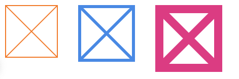

# CSS Houdini
> - Houdini是一个强大的项目，它让开发者可以直接访问浏览器的CSS引，进而有能力定制化CSS特性，并让这些特性在浏览器的原生渲染管道中高效运行
> - 这些自定义的CSS特性是在**worklets**中定义的，它是通过js实现

## 浏览器支持度
> - 目前为止，只有Google的Chrome实现了任何功能
> - 虽然Houdini的API得到浏览器支持的并不多，但是有一个Houdini的API你现在是可以玩起来的：CSS Paint API
> - js检查是否支持Paint API
```
if ('paintWorklet' in CSS) {}
```
> - css检查
```
@supports (background: paint(id)) { }
```
> - Paint API只在发布环境运行
> - worklets会被浏览器缓存，所以一定要禁用缓存，以便代码更新之后可以查看到
> - 不能设置断点，也不能在worklets中使用debugger调试，还好可以使用console.log()

## 优点
> - 提供创建自定义视觉效果的能力
> - 不依赖于向DOM添加额外的元素或伪元素
> - 作为浏览器渲染管道的一部分执行，提高效率
> - 比Polyfills更高效，更轻便
> - 提供了使用CSS Hacks的替代方案
> - 作为一处抽象和模块化的方法，通过一个Paint Worklet能包含更多的视觉逻辑
> - 创建全新类型的动画
> - 允许开发人员在浏览器实现新特性之前来解决未来浏览器支持问题
> - 五大浏览器厂商都打算支持Houdini

## 缺点
> - 发展中,需要良好的浏览器支持
> - 浏览器必须加载一个Paint Worklet文件，然后才能使用它，这可能导致样式弹出（pop-in）
> - 当前的开发者工具不支持设置断点或在Paint Worklet中使用debugger

## Paint Worklet
> - Paint Worklet的范围和功能是有限的。它们无法访问DOM，许多全局函数（比如setInterval）都无法访问。这有助于保持它们的高效和潜在的多线程
> - 个人感觉：很像写canvas，它把canvas与css结合起来了，

> - 我们先来实现一个占位符效果 


以前的方式
```bash
<div class="placeholder-dom"></div>
.placeholder-dom {
  position: relative;
  width: 100px;
  height: 100px;
  border: 2px solid #666;
  overflow: hidden;
}
.placeholder-dom:before {
  content: '';
  position: absolute;
  left: 0;
  top: 0;
  display: block;
  width: 2px;
  height: 200px;
  background: #666;
  transform: rotate(45deg) translateY(-100px);
}
.placeholder-dom:after {
  content: '';
  position: absolute;
  left: 0;
  bottom: 0;
  display: block;
  width: 2px;
  height: 200px;
  background: #666;
  transform: rotate(-45deg) translateY(100px);
}
```
// paint方式实现
```bash
// test.js
if (registerPaint) {
  class PlaceholderBoxPainter {
    paint(ctx, size) {
      ctx.lineWidth = 2
      ctx.strokeStyle = '#666'
      // 从左上角到右下角绘制一条线
      ctx.beginPath()
      ctx.moveTo(0, 0)
      ctx.lineTo(size.width, size.height)
      ctx.stroke()
      // 从右上角到左下角绘制一条线 
      ctx.beginPath()
      ctx.moveTo(size.width, 0)
      ctx.lineTo(0, size.height)
      ctx.stroke()
    }
  }
  registerPaint('placeholder-box', PlaceholderBoxPainter)
}
每当需要绘制元素时，就会调用paint()函数,这个函数提供了两个输入参数。ctx是我们所使用的对象，
就像CanvasRenderingContext2D对象,但是有一些限制（比如不能绘制文本）。size是用来设置我们要绘
制元素的height和width
...........................
// html
<div class="placeholder"></div>
.placeholder {
    background-image: paint(placeholder-box);
    width: 100px;
    height: 100px;
    // border: 2px solid #666;
}
// 如果不加border，则只实现了一个x
```

### 使用输入属性
> - （Typed Object Model（或Typed OM）提供）来实现这一点。这是Houdini的另一部分，但与Paint API不同，它仍然要在chrome://flags中开启实验性的Web平台特性(Experimental Web Platform features)

```bash
// js
if (registerPaint) {
  class PlaceholderBoxPropsPainter {
    static get inputProperties() {
      return ['border-top-width', 'border-top-color']
    }
    paint(ctx, size, props) {
      // default values
      ctx.lineWidth = 2
      ctx.strokeStyle = '#666'
      // set line width to top border width
      let borderTopWidthProp = props.get('border-top-width')
      if (borderTopWidthProp) ctx.lineWidth = borderTopWidthProp.value
      // set stroke style to top border color
      let borderTopColorProp = props.get('border-top-color')
      if (borderTopColorProp) ctx.strokeStyle = borderTopColorProp.toString()
      // 从左上角到右下角绘制一条线
      ctx.beginPath()
      ctx.moveTo(0, 0)
      ctx.lineTo(size.width, size.height)
      ctx.stroke()
      // 从右上角到左下角绘制一条线 
      ctx.beginPath()
      ctx.moveTo(size.width, 0)
      ctx.lineTo(0, size.height)
      ctx.stroke()
    }
  }
  registerPaint('placeholder-box-props', PlaceholderBoxPropsPainter)
}
// html
<script>
    if ('paintWorklet' in CSS && 'CSSUnitValue' in window) {
      CSS.paintWorklet.addModule('./demo2.js')
    }
</script>
  <style>
    .placeholder {
      background-image: paint(placeholder-box-props);
      width: 100px;
      height: 100px;
      margin: 20px;
      float: left;
    }
    .placeholder:nth-child(1) {
      border: 2px solid #fd7e14;
    }
    .placeholder:nth-child(2) {
      border: 6px solid #228be6;
    }
    .placeholder:nth-child(3) {
      border: 1rem solid #e64980;
    }
  </style>
```
效果如下


制作一个锯齿状的边缘

```bash
//js
if (registerPaint) {
  class JaggedEdgePainter {
    static get inputProperties() {
      return ['--tooth-width', '--tooth-height']
    }

    paint(ctx, size, props) {
      let toothWidth = props.get('--tooth-width').value
      let toothHeight = props.get('--tooth-height').value 

      let spaceBeforeCenterTooth = (size.width - toothWidth) / 2
      let teethBeforeCenterTooth = Math.ceil(spaceBeforeCenterTooth / toothWidth)
      let totalTeeth = teethBeforeCenterTooth * 2 + 1
      let startX = spaceBeforeCenterTooth - teethBeforeCenterTooth * toothWidth
      
      ctx.beginPath()
      ctx.moveTo(startX, toothHeight)

      for (let i = 0; i < totalTeeth; i++) {
        let x = startX + toothWidth * i
        ctx.lineTo(x + toothWidth / 2, 0)
        ctx.lineTo(x + toothWidth, toothHeight)
      }

      ctx.lineTo(size.width, size.height)
      ctx.lineTo(0, size.height)
      ctx.closePath()
      ctx.fill()
    }
  }

  registerPaint('jagged-edge', JaggedEdgePainter)
}
// html
  <script>
    if ('paintWorklet' in CSS && 'registerProperty' in CSS && 'CSSUnitValue' in window) {      
      CSS.registerProperty({
        name: '--tooth-width',
        syntax: '<length>',
        inherits: false,
        initialValue: '40px'
      })

      CSS.registerProperty({
        name: '--tooth-height',
        syntax: '<length>',
        inherits: false,
        initialValue: '20px'
      })

      CSS.paintWorklet.addModule('./demo3.js')
    }
  </script>
  <style>
    .jagged {
      background: paint(jagged-edge);
      position: absolute;
      top: 30%;
      bottom: 0;
      width: 100%;
      color: #fff;
    }
    .slot:nth-child(1) .jagged {
      --tooth-width: 50px;
      --tooth-height: 25px;
    }

    .slot:nth-child(2) .jagged {
      --tooth-width: 2rem;
      --tooth-height: 3rem;
    }

    .slot:nth-child(3) .jagged {
      --tooth-width: calc(33vw - 31px);
      --tooth-height: 2em;
    }

    .info {
      position: absolute;
      bottom: 10px;
      left: 10px;
    }   
  </style>
</head>
<body>
  <div class="container">
    <div class="slot">
      <div class="jagged">
        <div class="info">
          --tooth-width: 50px;<br>
          --tooth-height: 25px;
        </div>
      </div>
    </div>
    <div class="slot">
      <div class="jagged">
        <div class="info">
          --tooth-width: 2rem;<br>
          --tooth-height: 3rem;
        </div>
      </div>
    </div>
    <div class="slot">
      <div class="jagged">
        <div class="info">
          --tooth-width: calc(33vw - 31px);<br>
          --tooth-height: 2em;
        </div>
      </div>
    </div>
  </div>
</body>
```

小动画 - [DEMO5]()


[更多效果](https://css-houdini.rocks/tooltip)


